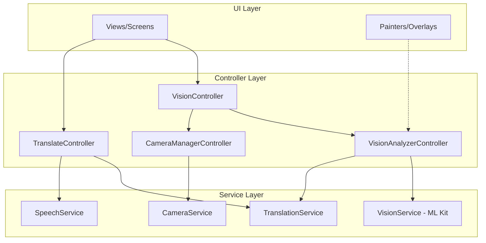

# Project Architecture: MobileAppTranslate

This document describes the architectural design of the MobileAppTranslate application, a cross-platform Flutter app for real-time translation and object detection.

## High-Level Architecture

The application follows a **Modular Layered Architecture** powered by the **GetX** state management framework. This separation ensures scalability, testability, and efficient resource management, especially for hardware-intensive tasks like camera streaming and ML inference.

---

## 🏗 Core Layers

### 1. Service Layer (`lib/services/`)
Low-level wrappers around platform-specific plugins and hardware.
- **`VisionService`**: Configures and manages Google ML Kit recognizers (Text, Object Detection) and custom TFLite models (EfficientNet-Lite).
- **`TranslationService`**: Handles on-device translation models and lifecycle.
- **`CameraService`**: Manages camera hardware initialization and configuration.
- **`SpeechService`**: Interfaces with STT (Speech-to-Text) and TTS (Text-to-Speech) engines.

### 2. Controller Layer (`lib/controllers/`)
 Orchestrates business logic and maintains observable state.
- **`VisionController`**: The primary coordinator for camera-based features (Live feed, capture, gallery pick).
- **`VisionAnalyzerController`**: Manages the ML processing pipeline, result smoothing, and translation of detected entities.
- **`TranslateController`**: Manages text-based translation, history, and voice interactions.
- **`CameraManagerController`**: Handles the lifecycle and stream of the `CameraController`.

### 3. UI Layer (`lib/views/`)
Declarative UI components and custom painters.
- **Vision Views**: Live camera preview with interactive overlays.
- **Painters**: High-performance `CustomPainter` implementations (`TextDetectorPainter`, `ObjectDetectorPainter`) that render detection boxes and translated text directly over the camera frames.

---

## ⚙️ ML Pipeline Execution

The application uses an **Event-Driven Pipeline** to process camera frames without blocking the UI thread (60fps UI, ~5-10fps ML).

1. **Input**: `CameraManagerController` starts an image stream.
2. **Preprocessing**: `ImageUtils` converts `CameraImage` (YUV/BGRA) to `InputImage` (ML Kit format).
3. **Inference**: `VisionAnalyzerController` sends frames to `VisionService` at a throttled interval (managed by `SettingsController`).
4. **Spatial Tracking**: `VisionResultsProcessor` maps incoming results to existing IDs using **Intersection over Union (IoU)**.
    - **Smoothing**: Bounding boxes are interpolated (LERP) across frames to eliminate jitter.
    - **OCR Cooldown**: A configurable temporal lock (default 1500ms) stabilizes the translation key even if the OCR text slightly varies (e.g., "Hello" vs "He1lo").
    - **Ghosting**: Briefly preserves lost text blocks to prevent flickering during minor camera occlusions.
5. **Translation**: Labels/Text are translated asynchronously via `TranslationService`.
6. **Output**: UI Observers trigger a repaint of the `CustomPainter` with updated coordinates and stable translations.

---

## 🛠 Tech Stack
- **Flutter**: UI Framework.
- **GetX**: Reactive state management and dependency injection.
- **Google ML Kit**: On-device machine learning (OCR, Detection, Transition).
- **EfficientNet-Lite**: Custom TFLite models for specialized object classification.
